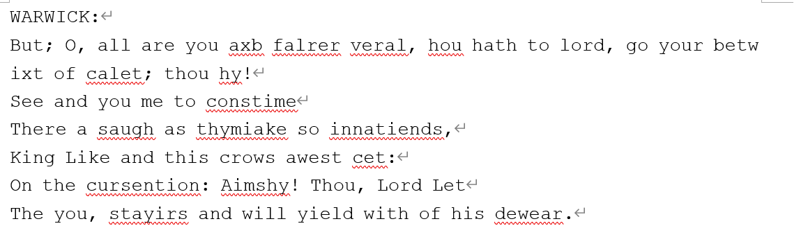
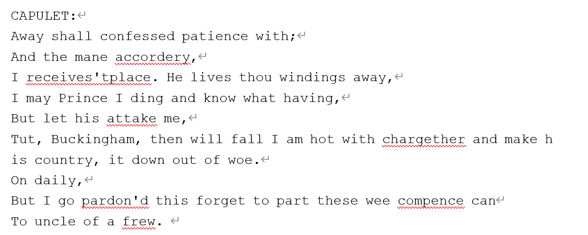
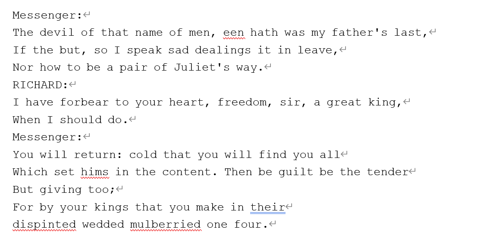

# MiniGPT
## Introduction

This project explores the implementation of a mini-GPT model, a simplified version of the powerful GPT-2 architecture.  It demonstrates the implementation of a generative pre-trained transformer model capable of text generation at a character level.  We use character-based Shakespeare dataset to generate a Shakespeare's-like text. This project covers aspects from data preparation, tokenization, model building, training, to generating new text based on trained models.


## Table of Contents

- [Environment setup](#environment-setup)
- [Dependency installation](#dependency-installation)
- [Instructions to run the code](#instructions-to-run-the-code)
- [Results and performance metrics](#performance-metrics-and-results)
- [Observations and findings](#observations-and-findings)
- [Reflection](#reflection)


## Environment setup

To run this project, ensure you have Python 3.x installed. 

## Dependency installation

```
pip install torch numpy random matplotlib math regex
```

Dependencies:

- [pytorch](https://pytorch.org) 
- [numpy](https://numpy.org/install/)
- [matplotlib](https://matplotlib.org/)
- [math](https://docs.python.org/3/library/math.html)
- [pickle](https://docs.python.org/3/library/pickle.html)
- [datasets](https://huggingface.co/docs/datasets/index)
- `regex`for data tokenization with regularization


## Instructions to run the code

- [`./utils_gpt.ipynb`](/utils_gpt.ipynb) - All the class and functions we constracted.
- [`./explore_data.ipynb`](/explore_data.ipynb) - Exploring the Shakespeare data set.
- [`./Compare_tokenizations.ipynb](/Compare_tokenizations.ipynb)- Comparison of three tokenization methods.
- [`./vocabulary](/vocabulary) - The vocabulary we saved.
- [`./mini_gpt_training.ipynb](/mini_gpt_training.ipynb) -Tuning hyperparameters
- [`./Best_model.ipynb](/Best_model.ipynb) - The best model
- [`./minigpt_fine_tuning.ipynb](/minigpt_fine_tuning.ipynb) - Fine-tuning
  


## Performance metrics and Results 
### Comparison within different tokenization methods
Naive Tokenization:


BPE:


BPE with Regularization:



### Hyperparameters tuning
We use cross-validation loss and human evaluation scores to evaluate our model.

After tuning hyperparameters, we obtained the best hyperparameters as follows:
| embeddings | layers | heads | batch size | block size | learning rate | drop out |
|------------|--------|-------|------------|------------|---------------|----------|
| 488        | 10     | 8     | 16         | 32         | 0.0001        | 0.1      |

In the following is the generated text with the best hyperparameters


## Observations and findings
### In hyperparameters tuning

### In fine-tuning based on Transfer Learning
Pretraining on a large dataset and fine-tuning on a small dataset seems to yield better results than pretraining on a small dataset and fine-tuning on a large one. A larger amount of data during pretraining enhances the model's generalization ability, which better facilitates the transfer to fine-tuning on a smaller dataset. However, due to significant differences in the distribution between the two datasets, freezing only the last linear layer does not yield good results. Fine-tuning only one layer of parameters is insufficient.

Although the performance of our fine-tuning based on the pre-trained model is not as ideal as we hoped, considering the long training time when training models, we can use fine-tuning when we want to accomplish a new task without wasting more time training an entire model from scratch. Fine-tuning allows the model to adapt to new tasks while retaining useful knowledge already learned, which is often much more efficient than training a completely new model from scratch.

## Reflection
### Running time issue:
Small vocabulary size of BPE
limit number of iterations
### Choosing Evaluation Metrics 
