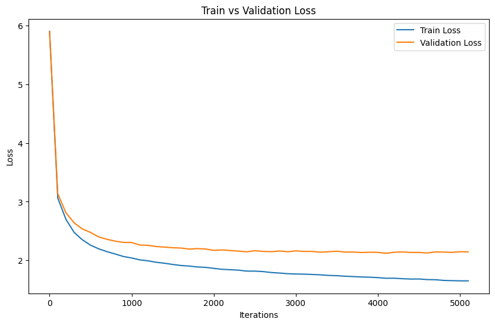

# MiniGPT
## Introduction

This project explores the implementation of a mini-GPT model, a simplified version of the powerful GPT-2 architecture.  It demonstrates the implementation of a generative pre-trained transformer model capable of text generation at a character level.  We use character-based Shakespeare dataset to generate a Shakespeare's-like text. This project covers aspects from data preparation, tokenization, model building, training, to generating new text based on trained models.


## Table of Contents

- [Environment setup](#environment-setup)
- [Dependency installation](#dependency-installation)
- [Instructions to run the code](#instructions-to-run-the-code)
- [Results and performance metrics](#performance-metrics-and-results)
- [Observations and findings](#observations-and-findings)
- [Reflection](#reflection)


## Environment setup

To run this project, ensure you have Python 3.x installed. 

## Dependency installation

```
pip install torch numpy random matplotlib math regex
```

Dependencies:

- [pytorch](https://pytorch.org) 
- [numpy](https://numpy.org/install/)
- [random](https://docs.python.org/3/library/random.html) for tuning hyperparametrs
- [matplotlib](https://matplotlib.org/)
- [math](https://docs.python.org/3/library/math.html)
- `regex`for data tokenization with regularization


## Instructions to run the code
You can run the notebook step by step. At the data tokenization part, you can choose one of three methods (Our results are based on BPE without regularization).

## Performance metrics and Results 


We can observe that both the training and validation losses decrease steadily with an increasing number of iterations, eventually converging to a low and comparable value. This indicates that the model has learned the data well and performs consistently on both seen (training) and unseen (validation) data. Furthermore, the lack of a significant gap between the two curves suggests that the model is not overfitting. Finally, we evaluate the model on the test dataset using CV Loss, BPC/BPW (Bits Per Character/Word), and Perplexity as metrics, the model attained notable results: an Average Loss of 2.1481, BPC/BPW at 3.0990, and Perplexity standing at 8.5682.

Here is a text gerneration example by using our pre-trained model with the best hyperparameters.

```
ESCALUDIO:
Fell, my lord, shall be at his friends.

NORTHUMBERLAND:
A kingdom, and you further who is purdcoated now else.
And here be found. Prithee, came and no mortal cuqual feetch!
Not weeping tears both give heard, or either disors
many words: addesperated these weaks tears,
Takest birds for her cause hath sbecomed;
That now arise mars: most rebed my noble hath best,
With honour sins. Wantons on a littled grave:
The plain earnest all by faul brain thy tlews:
No, she signs to remembers from brother fromows?
```


## Observations and findings


## Reflection

