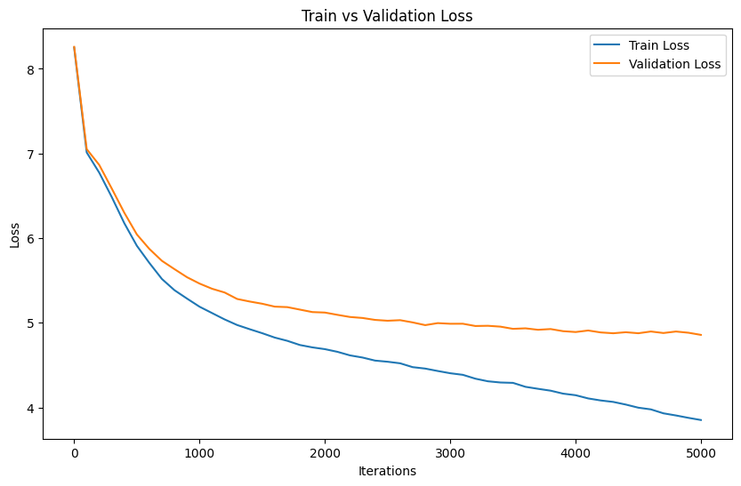

# MiniGPT
## Introduction

This project explores the implementation of a mini-GPT model, a simplified version of the powerful GPT-2 architecture.  It demonstrates the implementation of a generative pre-trained transformer model capable of text generation at a character level.  We use character-based Shakespeare dataset to generate a Shakespeare's-like text. This project covers aspects from data preparation, tokenization, model building, training, to generating new text based on trained models.


## Table of Contents

- [Environment setup](#environment-setup)
- [Dependency installation](#dependency-installation)
- [Instructions to run the code](#instructions-to-run-the-code)
- [Results and performance metrics](#performance-metrics-and-results)
- [Observations and findings](#observations-and-findings)
- [Reflection](#reflection)


## Environment setup

To run this project, ensure you have Python 3.x installed. 

## Dependency installation

```
pip install torch numpy  matplotlib math regex pickle datasets time
```

Dependencies:

- [pytorch](https://pytorch.org) 
- [numpy](https://numpy.org/install/)
- [matplotlib](https://matplotlib.org/)
- [math](https://docs.python.org/3/library/math.html)
- [pickle](https://docs.python.org/3/library/pickle.html)
- [datasets](https://huggingface.co/docs/datasets/index)
- [time](https://docs.python.org/3/library/time.html)
- `regex`for data tokenization with regularization


## Instructions to run the code
You can run the code separately depending on what you want, the contents of our code are following:

- [`./utils_gpt.ipynb`](/utils_gpt.ipynb) - All the class and functions we constracted.
- [`./explore_data.ipynb`](/explore_data.ipynb) - Exploring the Shakespeare data set.
- [`./Compare_tokenizations.ipynb](/Compare_tokenizations.ipynb)- Comparison of three tokenization methods.
- [`./vocabulary](/vocabulary) - The vocabulary we saved.
- [`./mini_gpt_training.ipynb](/mini_gpt_training.ipynb) -Tuning hyperparameters
- [`./Best_model.ipynb](/Best_model.ipynb) - The best model
- [`./minigpt_fine_tuning.ipynb](/minigpt_fine_tuning.ipynb) - Fine-tuning
  


## Performance metrics and Results 

We use cross-validation loss and human evaluation scores to evaluate our model.
After tuning hyperparameters, we obtained the best hyperparameters as follows:
| embeddings | layers | heads | batch size | block size | learning rate | drop out |
|------------|--------|-------|------------|------------|---------------|----------|
| 488        | 10     | 8     | 16         | 32         | 0.0001        | 0.1      |

In the following is the generated text with the best hyperparameters



## Discussion
- **Vocabulary Size Limitations**: Due to hardware constraints, we set the vocabulary size to only 3,257, which is significantly smaller than GPT-2's 50,257. This limitation may reduce our model's accuracy in semantic understanding and the quality of text generation, especially for complex or linguistically rich content.
- **Number of Iterations**: We capped the number of iterations at 5,000 due to hardware limitations. This restriction suggested the model was undertrained as both training and validation losses continued to decrease at this threshold, indicating potential missed optimal parameters.
- **Learning Rate Warm-up**: We found that starting with a very low learning rate and gradually increasing it helped stabilize the training. This approach improved the model's performance compared to using a fixed rate, which led to instability or slow convergence.
- **Text Evaluation Metrics**: We relied on validation loss and subjective human evaluation for assessing text quality because implementing BLEU scores proved challenging. The dependency of BLEU scores on the quality and comprehensiveness of reference texts was a limiting factor.
- **Early Stopping**: We employed early stopping to prevent overfitting, but this technique sometimes halted the training too soon, as evidenced by poorer performance of text generated under early stopping conditions compared to slightly overfit models.

