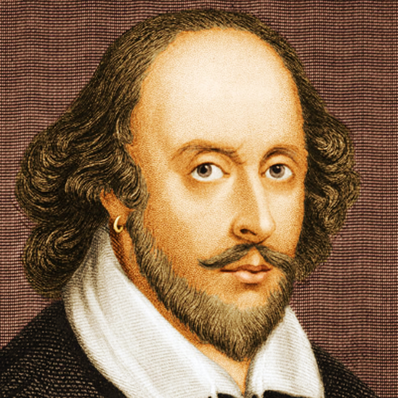

# MiniGPT
## Introduction

This project explores the implementation of a mini-GPT model, a simplified version of the powerful GPT-2 architecture.  It demonstrates the implementation of a generative pre-trained transformer model capable of text generation at a character level.  We use character-based Shakespeare dataset to generate a Shakespeare's-like text. This project covers aspects from data preparation, tokenization, model building, training, to generating new text based on trained models.





## Table of Contents

- [Environment setup](#environmentsetup)
- [Dependency installation](#install)
- [Instructions to run the code](#instructions)
- [Results and performance metrics](#results)
- [Observations and findings](#findings)
- [Reflection](#reflection)


## Environment setup

To run this project, ensure you have Python 3.x installed. 

## Dependency installation

```
pip install torch numpy random matplotlib math regex
```

Dependencies:

- [pytorch](https://pytorch.org) 
- [numpy](https://numpy.org/install/)
- [random](https://docs.python.org/3/library/random.html) for tuning hyperparametrs
- [matplotlib](https://matplotlib.org/)
- [math](https://docs.python.org/3/library/math.html)
- `regex`for data tokenization with regularization


## Instructions to run the code
You can run the notebook step by step. At the data tokenization part, you can choose one of the methods( our results is based on BPE without regularization).

## Results and performance metrics


## Observations and findings

## Reflection

